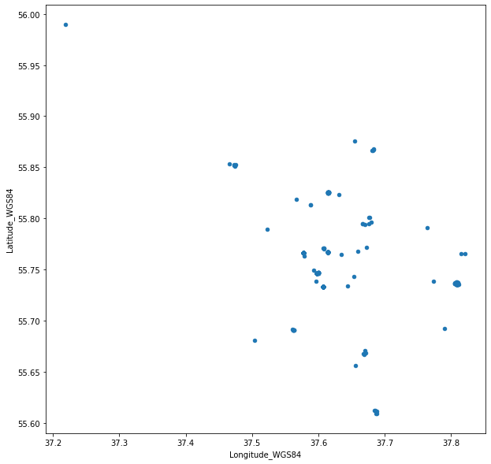

# 9-HW

В файле [sculptures.csv](sculptures.csv) лежит табличка с информацией о скульптурах в Москве. 

## Задание 1

Средствами pandas найдите 5 самых частотных материалов, из которых делались скульптуры. 

Код должен возвращать список из 5 строк в порядке от 1 к 5 самому частотному материалу. То есть выдача в таком формате:

['Бетон', 'Алюминий', 'Гипс', 'Медь', 'Металл'] 

## Задание 2

Средствами pandas найдите медианный год создания для всех скульптур, стоящих в парке «Музеон», кроме бронзовых. Обратите внимание на разные варианты написания слова «Музеон». 

Код должен возвращать конкретный год (числом, т.е. int или float). Год должен быть получен методами библиотеки pandas.

Работающий код с решением должен находиться в файле task2.py 

## Задание 3 

1. Средствами pandas визуализируйте  широту и долготу расположения объектов из файла sculptures.csv в виде диаграммы рассеяния (scatter plot). По иксу должна быть долгота, по игреку — широта. Это даст вам расположение скульптур на карте Москвы (конечно, без подложки в виде карты, но сами точки будут расположены дотносительно друг друга как на карте).  Посмотрите на результат. 
2. Глядя на получившийся scatterplot, определите, что пошло не так при заполнении этих данных и как выделить скульптуру, для которой координаты указаны заведомо неверно. Найдите такую скульптуру средствами pandas (при помощи задания условий на значение широты и/или долготы). 

Ваш код должен возвращать **значение поля global_id ошибочного объекта**, полученное средствами pandas из исходный таблички. Т.е. число вида 1058625259. Работающий код с решением должен находиться в файле task3.py 

NB: ваш код **не** должен возвращать визуализацию. 

После выполнения задания попробуйте визуализировать scatter plot широты и долготы без этой ошибочной скульптуры. Убедитесь, что теперь scatter plot отражает приблизительно такую картину: 

(т.е. визуализация широты и долготы объектов действительно стала немного похожа на карту Москвы). Загрузите визуализацию в репозиторий в виде png-файла.

Кстати, возможно вам будет интересно узнать, что эта ошибка в данных настоящая, а не придумана нами для задания. Она пришла из [оригинальной версии этого датасета](https://data.mos.ru/opendata/7702155262-perechen-skulptur-pod-otkrytym-nebom-raspolojennyh-na-territorii-uchrejdeniy-podvedomstvennyh-departamentu-kultury-goroda-moskvy) на портале открытых данных правительства Москвы.  
